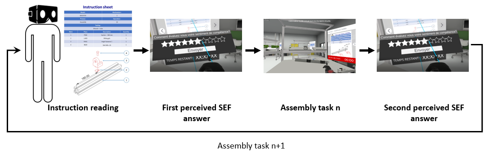
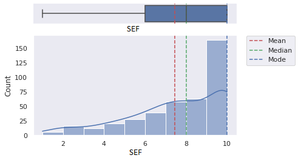

# IVRASED - Industrial VR Activity Self-Efficacy Dataset 

## Objectives
We introduce a **multi-modal physiological dataset** named "Industrial VR Activity Self-Efficacy Dataset" (**IVRASED**) to study Self-efficacy of a learner during learning task in a virtual reality learning environment (**VRLE**), especially in an industrial use-case. (assembly task).

This dataset should allow learner analysis and modeling, in order to persue the goal to make an Intelligent Tutoring System (ITS) through the study of learner Self-efficacy.

## Download

The dataset can be downloaded from this link :  https://bit.ly/IVRASED  

## Dataset description
**IVRASED** dataset consists of two parts: 
1.	**Physiological recording** (EEG, ECG, GSR, Eye-tracking) of 15participants done in an **industrial VRLE** during assembly task for around 1hour long, including the VR recorded video.
2.	The perceived **self-efficacy** of the current task self-assessed before and after the assemblage on a discrete 10-point scale (range of 1 to 10)




Assembly task        |  SEF answer
:-------------------------:|:-------------------------:
|


## Modalities  
### Acquisition material 
iMotions platform has been used to organize the study and aggregate all the sensors data.

| Sensor       | Reference          | Sampling frequency |
| ------------ | ------------------ | ------------------ |
| EEG          | B-Alert-X10t       | 256Hz              |
| ECG          | Shimmer EXG        | 512Hz              |
| GSR          | Shimmer GSR 3+     | 128Hz              |
| Eye-tracking | Tobii Eye Tracking | 64Hz               |

The B-Alert-X10t provides 3 types of datas. Raw and decontaminated signals sampled at 256Hz and brain metric through iMotions platform at 1Hz. ECG signal is delivered along 3 leads at 512Hz , supplied with heartrate and interbeat interval at 1Hz. GSR sensor provide a raw signal sampled at 128Hz, both extracted GSR conductance and resistance, and a realtime analysis of peak properties. iMotions include a real-time ET analysis alongside pupillometry, giving clue about fixations and saccades properties.

## File details 
We provide both [raw](#dataset)  and 
[preprocessed data.](#processed-files)


```
raw_data/
├── csv/
│   ├── (respondent_id)_(sequence_id).csv
│   └── ...
├── parquet/
│   ├── (respondent_id)_(sequence_id).parquet
│   └── ...

pre_processed_data/
├── iMotionsToPython/ #list of dataframe with data sampled to 128Hz
│   ├── BySequence/
│   │   ├── (respondent_id)_(sequence_id)_full_features_data.array
│   │   ├── (respondent_id)_(sequence_id)_annotation_data
│   │   └── (respondent_id)_(sequence_id)_dict
│   │   └── ...
│   └── AllSquence/ #Aggregated file
│   │   └── all_data_full_features_10_classes.array
├── processed_sensor_combination/(fold_number)/
│   ├── Sensor n x Sensor m x Sensor k/
│   │   ├── X_train.npy
│   │   ├── Y_train.npy
│   │   ├── X_test.npy
│   │   └── Y_test.npy
│   ├── Sensor n x Sensor m/
│   │   └── ...
│   └── ...
```
# Dataset

Original raw data recordings are exported through iMotions platform and saved into CSV format.
We also provide the data under parquet format which is faster in read and takes less storage space.

There are 34 files. Each participant have consecutively done two sequence, therefore there is two files for each subject, except for the participants : 
- ee2d3 who realised only Sequence1 due to cybersickness.
- 2f672e and 317ed5 which have both sequence 1 and sequence 2 in two part and 3754b5 which have sequence 2 in two part, due to hardware disconnection.

Sequence organisation is presented [below.](#sequence-organisation) 

Filenames follow this specific pattern : 
"*(respondent_id)_(sequence_number).csv*", e.g. : 02e52_sequence1.csv. Participant id list can be found [below.](#self-efficacy) 


Raw data files respect this specific pattern of 3 parts: 
- #INFO:  general information about the recorded data
- #METADATA: explanatory information for each of the data-columns
- #DATA: sensor data

Feature set (from different source signal) can be identified by the *"#Device"* row:
- *"B-Alert EEG"* for EEG data (EEG)
- *"B-Alert Decontaminated EEG"* for decontamined EEG data (EEG_dec)
- *"B-Alert BrainState"* for brain metrics (EEG_brainstate)
- *"Eyetracker HTC VIVE Pro Eye"* for raw Eye-Tracking data (Eye-Tracking)
- *"R Analysis GazeAnalysis I-VT filter"* for Eye-Tracking analysis (GazeAnalysis)
- *"Shimmer shim exg 02 5F2F ECG"* for ECG data (ECG)
- *"Shimmer GSR 4B59"* for GSR data (GSR)


  

<details>
<summary><ul> <b> EEG</b> <i>(click to drop down) </i> </ul>  </summary>
Decontaminated signals are obtain after the appliance of decontamination algorithms that remove 5 artifacts types (EMG, EOG, excursion, saturations, spikes).

Brain metrics are provided by iMotions thanks to a 9-minutes benchmark session before the experiment.

| Feature set              | Feature name                                                              | Feature description                                                                                    |
| ------------------ | ------------------------------------------------------------------------- | ---------------------------------------------------------------------------------------------- |
| EEG                | EEG\_(Poz \\| Fz \\| Cz \\| C3 \\| C4 \\| F3 \\| F4 \\| P3 \\| P4)        | 9 raw channels named  according to the 10/20 system                                            |
| EEG_dec| EEG\_Decon\_(Poz \\| Fz \\| Cz \\| C3 \\| C4 \\| F3 \\| F4 \\| P3 \\| P4) | 9 decontamined channels of artifacts                                                           |
| EEG_brainstate       | EEG\_Metric\_Classification                                               | Engagement score                                                                               |
| EEG_brainstate      | EEG\_Metric\_High\_Engagement                                             | Probability that respondent is in a state of high engagement (Level 1 of the Engagement score) |
| EEG_brainstate      | EEG\_Metric\_Low\_Engagement                                              | Probability that respondent is in a state of low engagement (Level 2 of the Engagement score)  |
| EEG_brainstate       | EEG\_Metric\_Distraction                                                  | Probability that respondent is in a state of distraction (Level 3 of the Engagement score)     |
| EEG_brainstate       | EEG\_Metric\_Drowsy                                                       | Probability that respondent is in a state of drowsiness (Level 4 of the Engagement score)      |
| EEG_brainstate       | EEG\_Metric\_Workload\_FBDS                                               | Workload score (FBDS Method )                                                                  |
| EEG_brainstate       | EEG\_Metric\_Workload\_BDS                                                | Workload score (BDS Method)                                                                    |
| EEG_brainstate       | EEG\_Metric\_Workload\_Average                                            | Workload score (Computed as the average of FBDS and BDS method)                                |

</details>


<details>
<summary> <ul> <b> ECG </b> </ul> </summary>

| Feature set     | Feature name                    | Feature description                                                                                     |
| --------- | ------------------------------- | ------------------------------------------------------------------------------------------------------- |
| ECG       | ECG (LL-RA \\| LA-RA \\| Vx-RL) RAW | Raw Electrocardiography signal (unitless) of the corresponding  lead from Shimmer ADC                   |
| ECG       | ECG LL-RA CAL                   | Electrocardiography signal between left leg and right arm                                               |
| ECG       | ECG LA-RA CAL                   | Electrocardiography signal between left arm and right arm                                               |
| ECG       | ECG Vx-RL CAL                   | Electrocardiography signal measured from the Wilson's Central Terminal (WCT) voltage to the Vx position |
| ECG_HR | Heart Rate ECG LL-RA ALG        | Heart rate calculated in Shimmer SDK                                                                    |
| ECG_HR | IBI ECG LL-RA ALG               | Inter-Beat-Interval, time interval between heart beats, calculated in Shimmer SDK                       |
</details>

<details>
<summary><ul> <b> GSR</ul> </b> </summary>
 

| Feature set  | Feature name                     | Feature description                                    |
| --------- | -------------------------------- | ------------------------------------------------------ |
| GSR       | GSR RAW                          | Galvanic skin response (unitless)                      |
| GSR       | GSR Resistance CAL               | GSR skin resistance                                    |
| GSR       | GSR Conductance CAL              | GSR skin conductance                                   |
| GSR       | Internal ADC A13 PPG (RAW\\|CAL) | PPG blood volume pulse raw or calibrated               |
| GSR_HR | Heart Rate PPG ALG               | Calculated heart rate                                  |
| GSR_HR | IBI PPG ALG                      | Inter-beat-interval. Time interval between heart beats |
</details>

<details>
<summary><ul> <b> Eye-tracking</ul> </b> </summary>

| Feature set        | Feature subset              | Feature name                       | Feature description                                                                                                                                                                                         |
| ------------ | --------------------- | ---------------------------------- | ----------------------------------------------------------------------------------------------------------------------------------------------------------------------------------------------------------- |
| Eye-Tracking | ET(Gaze 2D)           | ET\_Gaze(Left\\|Right)(X\\|Y)      | Coordinate of the  gaze point (2D) of the corresponding axis and eye                                                                                                                                        |
| Eye-Tracking | ET(Pupillometry data) | ET\_Pupil(Left\\|Right)            | Pupil diameter of the corresponding eye                                                                                                                                                                     |
| Eye-Tracking | ET(Distance)          | ET\_Distance(Left\\|Right)         | Estimated distance between the eye-tracker and the corresponding eye                                                                                                                                        |
| Eye-Tracking | ET(Capture)           | ET\_Camera(Left\\|Right)(X\\|Y)    | Coordinate of the corresponding eye relative to the eye-tracker                                                                                                                                             |
| Eye-Tracking | ET(Head)              | ET\_HeadRotation(X\\|Y\\|Z)        | Head rotation Euler angle in the corresponding axis                                                                                                                                                         |
| Eye-Tracking | ET(Head)              | ET\_HeadPositionVector(X\\|Y\\|Z)  | Head position vector in the corresponding axis                                                                                                                                                              |
| Eye-Tracking | ET(Head)              | ET\_HeadVelocity(X\\|Y\\|Z)        | Head velocity vector in the corresponding axis                                                                                                                                                              |
| Eye-Tracking | ET(Head)              | ET\_HeadAngularVelocity(X\\|Y\\|Z) | Head angular velocity vector in the corresponding axis                                                                                                                                                      |
| Eye-Tracking | ET(Expression)        | ET\_(Left\\|Right)EyeOpenness      | Corresponding Eye Openness                                                                                                                                                                                  |
| Eye-Tracking | ET(Expression)        | ET\_(Left\\|Right)EyeSqueeze       | Corresponding Eye Squeeze                                                                                                                                                                                   |
| Eye-Tracking | ET(Expression)        | ET\_(Left\\|Right)EyeFrown         | Corresponding Eye Frown                                                                                                                                                                                     |
| Eye-Tracking | ET(Other)             | ET\_VR\_HeadsetConnectedState      | HMD connected (0 = disconnected, 1 = connected)                                                                                                                                                             |
| GazeAnalysis | ET(Gaze data, 2D)     | Gaze (X\\|Y)                       | Gaze Average of the coordinates of the left and right eye of the corresponding axis                                                                                                                         |
| GazeAnalysis | ET(Gaze data, 2D)     | Interpolated Gaze (X\\|Y)          | Average of the coordinates of the left and right eye of the corresponding axis with missing coordinates interpolated.                                                                                       |
| GazeAnalysis | ET(Distance)          | Interpolated Distance              | Estimated distance between the eye-tracker and the eyes, with missing values interpolated.                                                                                                                  |
| GazeAnalysis | ET(Gaze movements)    | Gaze Velocity                      | Angular velocity of the gaze at the current sample point                                                                                                                                                    |
| GazeAnalysis | ET(Gaze movements)    | Gaze Acceleration                  | Angular acceleration of the gaze at the current sample point                                                                                                                                                |
| GazeAnalysis | ET(Fixations)         | Fixation Index                     | Fixation number, counting from start of the recording.                                                                                                                                                      |
| GazeAnalysis | ET(Fixations)         | Fixation Index by Stimulus         | Fixation number, counting from start of the stimulus. Useless                                                                                                                                               |
| GazeAnalysis | ET(Fixations)         | Fixation (X\\|Y)                   | X and Y Coordinate of the fixation centroid (relative to top-left corner of the screen).                                                                                                                    |
| GazeAnalysis | ET(Fixations)         | Fixation (Start\\|End)             | Start or End time of the fixation (relative to recording start).                                                                                                                                            |
| GazeAnalysis | ET(Fixations)         | Fixation Duration                  | Duration of the fixation.                                                                                                                                                                                   |
| GazeAnalysis | ET(Fixations)         | Fixation Dispersion                | Dispersion of the fixation, i.e. how much the fixation's gaze points are spread out.                                                                                                                        |
| GazeAnalysis | ET(Saccades)          | Saccade Index                      | Saccade number, counting from start of the recording.                                                                                                                                                       |
| GazeAnalysis | ET(Saccades)          | Saccade Index by Stimulus          | Saccade number, counting from start of the stimulus. Useless                                                                                                                                                |
| GazeAnalysis | ET(Saccades)          | Saccade (Start\\|End)              | Start ord End time of the saccade (relative to recording start).                                                                                                                                            |
| GazeAnalysis | ET(Saccades)          | Saccade Duration                   | Duration of the saccade.                                                                                                                                                                                    |
| GazeAnalysis | ET(Saccades)          | Saccade Amplitude                  | Amplitude of the saccade (angular distance that the eyes travelled from start point to end point)                                                                                                           |
| GazeAnalysis | ET(Saccades)          | Saccade Peak Velocity              | Peak velocity of the saccade (the maximal speed of the eyes during this saccade)                                                                                                                            |
| GazeAnalysis | ET(Saccades)          | Saccade Peak Acceleration          | Peak acceleration of the saccade (the maximal increase in speed of the eyes during this saccade)                                                                                                            |
| GazeAnalysis | ET(Saccades)          | Saccade Peak Deceleration          | Peak deceleration of the saccade (the maximal decrease in speed of the eyes during this saccade)                                                                                                            |
| GazeAnalysis | ET(Saccades)          | Saccade Direction                  | Direction of the saccade from its start point to end point, indicated as counterclockwise angles: 0 degrees mean a horizontal saccade from left to right, 90 degrees a vertical saccade from bottom to top. |

</details>
<br>


## Self-efficacy
A total of 15 (10 males, 5 females) distinct participants were invited to perform industrial assembly task, age range is from 20 to 50. All the participants have completed higher education studies. Participants have been anonymized with an unique id number.

The self-assessed self-efficacy of the current task rated before and after the assemblage on a discrete 10-point scale (range of 1 to 10)

Self-efficacy is reported in the "External events API" columns:
- **MarkerName**="**SOC_DISPLAY**" corresponds to the time when the question is displayed 
- **MarkerName**="**SOC_ANSWER**" corresponds to the time when the participant answer. The value of his **perceived self-efficacy** is given in the "**MarkerDescription**" column. 

<details>
  <summary>Summary <i> (Click to expand)</i> </summary>

| Participant id | Number of SOC answered | Mean SOC answered | Minutes recorded |
| -------------- | ---------------------- | ----------------- | ------- |
| 02e52          | 30                     | 9                 | 54      |
| 253ff          | 20                     | 3,2               | 62      |
| 2f672          | 28                     | 9,1               | 48      |
| 317ed          | 28                     | 8,2               | 82      |
| 3754b          | 28                     | 9,1               | 55      |
| 375bc          | 30                     | 5,1               | 71      |
| 58f78          | 30                     | 7,4               | 67      |
| 90ba6          | 30                     | 6,9               | 62      |
| adbef          | 30                     | 7,7               | 57      |
| b9d5e          | 28                     | 7,2               | 64      |
| bb01e          | 30                     | 8,8               | 43      |
| bbd0c          | 30                     | 6,8               | 63      |
| cb295          | 24                     | 7,8               | 79      |
| cf0f7          | 30                     | 8,6               | 49      |
| ee2d3          | 10                     | 2,5               | 34      |
| **Total**      | **406**                | **7,5**           | **890** |

</details>

<br><br>



### Sequence organisation
Each participant have subsequently done two sequence. 
* Sequence 1 is composed of 6 assembly tasks : 
  * P4-010, P4-011, **P4-020**, P4-030, P2-010, P2-020, P2-021, **P2-022**.
* Sequence 2 is composed of 9 assembly tasks : 

  * P1-010, P1-020, **P1-030**, **P3-010**, P3-020, P3-030.

Situation in bold are designed as more complex than other as they synthetise assembly step. [(example here)](/rsc/instruction_sheet_example/subsystem_synthesis.png) 

Instruction sheet example can be found [here.](/rsc/instruction_sheet_example) 


## Processed files 
File processing used is described in the paper and can be accessed [here.](/Preprocessing) 


## Citation
To cite this work, please use:
``` 
{updated after review process}
```
